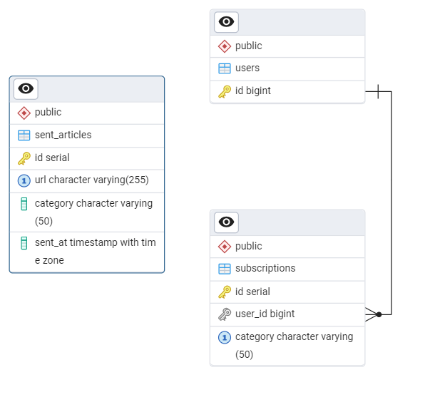

## News Update Bot
Данный бот использует NewsAPI для отслеживания новостей с большого количества источников (7500+). Он позволяет пользователю выбрать определенную категорию для отслеживания актуальных новостей. После подписки на определенные рассылки, бот будет присылать уведомления при появлении новых статей.

1) Backend: Go
2) DataBase: PostgreSQL
3) API: NewsAPI

# Участники проекта
Грибкова Екатерина 5130904/20102

# Определение проблемы

Пользователи сталкиваются с неудобствами при поиске актуальных новостей по интересующим их темам, так как им приходится вручную проверять множество различных источников. Отсутствие персонализированных уведомлений может привести к пропуску важных новостей и лишней трате времени.

## Выработка требований

### Пользовательские истории
1. Как пользователь, я хочу подписаться на определенные категории новостей (например, технологии, бизнес), чтобы получать только релевантные статьи.
   - Задача: Использовать команду `/add <category>` для подписки и получать подтверждение.
2. Как пользователь, я хочу просматривать новости по выбранной категории по запросу, чтобы оставаться в курсе интересующих меня тем.
   - Задача: Использовать команду `/news <category>` для получения до 5 последних статей с заголовком, описанием и ссылкой.
3. Как пользователь, я хочу периодически получать новости по моим подпискам, чтобы не проверять их вручную.
   - Задача: Автоматически получать новые статьи каждые 5 минут для подписанных категорий.

### Оценка пользователей
- 10 000 активных пользователей в сутки, предполагая популярность среди студентов и профессионалов, интересующихся новостями.
- Период хранения данных: Новости и подписки пользователей будут храниться 5 лет для поддержки исторического анализа и возможных регуляторных требований.

## Разработка архитектуры и детальное проектирование

### Подписка на категорию (`/add <category>`)
- 1 запрос к Telegram API (`/sendMessage`) для отправки подтверждения.
- 1 запрос к базе данных для сохранения подписки.

### Запрос новостей (`/news <category>`)
- 1 запрос к базе данных для проверки подписки (опционально, если есть валидация).
- 1 запрос к внешнему News API для получения новостей.
- 1+ запросов к Telegram API (`/sendMessage`) для отправки статей (до 5 сообщений).

### Просмотр подписок (`/mysubs`)
- 1 запрос к базе данных для получения списка подписок.
- 1 запрос к Telegram API (`/sendMessage`) для отправки ответа.

### Получение справки или старт (`/help`, `/start`)
- 1 запрос к Telegram API (`/sendMessage`) для отправки сообщения.

### Автоматическое получение новостей (`CheckAndSendNews`)
- 1 запрос к базе данных для получения всех подписок.
- 1 запрос к News API для каждой категории (например, 2 категории).
- 1+ запросов к Telegram API (`/sendMessage`) для отправки новостей каждому пользователю (до 5 сообщений на категорию).

### Предположения о поведении пользователей
- Каждый из 10 000 пользователей в среднем:
  - Выполняет 1 подписку в день (`/add`).
  - Запрашивает новости 2 раза в день (`/news`).
  - Проверяет подписки 1 раз в день (`/mysubs`).
  - Использует `/start` или `/help` 0.5 раза в день.
  - Получает автоматические новости 12 раз в день (каждые 5 минут, 12 циклов `CheckAndSendNews`).
- Каждая команда `/news` или автоматическая отправка возвращает до 5 статей.
- Средний размер статьи: 1 КБ (JSON с заголовком, описанием, URL).

### Соотношение R/W нагрузки

#### Read (Чтение)
- **Telegram API**:
  - Получение обновлений (`/getUpdates` или вебхуки): ~10 000 пользователей × 5 команд/день = 50 000 запросов.
  - Все эндпоинты Telegram API для получения данных (например, `/getMe`) являются Read-операциями.
- **News API**:
  - Запросы к `/top-headlines` для `/news`: 10 000 × 2 запроса/день = 20 000 запросов.
  - Запросы для `CheckAndSendNews`: 2 категории × 12 циклов/день = 24 запроса.
- **Database (PostgreSQL)**:
  - Чтение подписок для `/mysubs`: 10 000 запросов/день.
  - Чтение всех подписок для `CheckAndSendNews`: 12 запросов/день.
  - Проверка подписки для `/news` (если есть): 20 000 запросов/день.

#### Write (Запись)
- **Telegram API**:
  - Отправка сообщений (`/sendMessage`):
    - Для `/add`: 10 000 сообщений/день.
    - Для `/news`: 10 000 × 2 запроса × 5 сообщений = 100 000 сообщений/день.
    - Для `/mysubs`: 10 000 сообщений/день.
    - Для `/start`/`/help`: 10 000 × 0.5 = 5 000 сообщений/день.
    - Для `CheckAndSendNews`: 10 000 пользователей × 2 категории × 5 сообщений × 12 циклов = 1 200 000 сообщений/день.
- **Database (PostgreSQL)**:
  - Сохранение подписки (`/add`): 10 000 записей/день.
  - Логирование взаимодействий (если реализовано): ~50 000 записей/день (по 5 команд/пользователь).
- **Временные файлы**:
  - Нет значительных операций записи на диск, так как бот не создает мультимедиа.

#### Вывод
- По количеству запросов: Read-запросы (~100 036) составляют ~30%, Write-запросы (~1 475 000) ~70%. Соотношение R/W ~ 1:14.
- По потреблению ресурсов: Write-запросы к Telegram API и News API более затратны из-за сетевых задержек и обработки Markdown. Соотношение R/W по ресурсам ~ 1:5.

### Объемы трафика

#### Внутренний трафик (между сервисами)
- **Telegram API**:
  - Входящие обновления (`/getUpdates`): JSON ~1 КБ/обновление. 50 000 обновлений × 1 КБ = 50 МБ/день.
  - Исходящие сообщения (`/sendMessage`): Текст ~500 байт/сообщение. 1 415 000 сообщений × 0.5 КБ = ~708 МБ/день.
- **News API**:
  - Запросы: ~200 байт/запрос. (20 000 + 24) × 0.2 КБ = ~4 МБ/день.
  - Ответы: 5 статей × 1 КБ/статья. (20 000 + 24) × 5 КБ = ~100 МБ/день.
- **Database**:
  - Запросы/ответы: ~100 байт/запрос. 90 012 запросов × 0.1 КБ = ~9 МБ/день.
- **Итого внутренний трафик**: ~50 + 708 + 4 + 100 + 9 = 871 МБ/день.

#### Внешний трафик (между ботом и Telegram)
- Входящий: 50 000 обновлений × 1 КБ = 50 МБ/день.
- Исходящий: 1 415 000 сообщений × 0.5 КБ = 708 МБ/день.
- **Итого внешний трафик**: 50 + 708 = 758 МБ/день.

### Объемы дисковой системы

#### База данных (PostgreSQL)
- **Таблицы**:
  - `users`: 10 000 пользователей × ~200 байт/запись = ~2 МБ.
  - `subscriptions`: 10 000 подписок × ~100 байт/запись = ~1 МБ/день. За 5 лет: 1 МБ × 365 × 5 = ~1.8 ГБ.
  - `articles`: 100 статей/день × 2 категории × ~1 КБ/статья = 200 КБ/день. За 5 лет: 200 КБ × 365 × 5 = ~365 МБ.
- **Индексы**: Примерно 50% от данных, ~1 ГБ за 5 лет.
- **Логирование (если реализовано)**: 50 000 взаимодействий/день × 100 байт = 5 МБ/день. За 5 лет: 5 МБ × 365 × 5 = ~9 ГБ.
- **Итого для БД**: ~2 МБ (users) + 1.8 ГБ (subscriptions) + 365 МБ (articles) + 1 ГБ (индексы) + 9 ГБ (логи) = ~12 ГБ за 5 лет.

#### Временные файлы
- Бот не создает мультимедиа, поэтому временные файлы минимальны.
- Возможны временные JSON-файлы для кэширования ответов News API: ~1 КБ/статья × 200 статей/день = 200 КБ/день.
- При 100 одновременных запросов: 100 × 200 КБ = 20 МБ временного пространства.
- Рекомендуется настроить автоматическую очистку (например, cron job) для удаления устаревших файлов.
- **Итого для временных файлов**: 20-50 МБ с учетом запаса и возможных сбоев.

#### Вывод
- **Соотношение R/W**:
  - По количеству запросов: ~1:14 (Write доминирует из-за отправки сообщений).
  - По ресурсам: ~1:5 (Write-запросы более затратны).
- **Трафик**:
  - Внутренний: ~871 МБ/день.
  - Внешний: ~758 МБ/день.
- **Диск**:
  - База данных: ~12 ГБ за 5 лет.
  - Временные файлы: 20-50 МБ с очисткой.

## Диаграмма C4 model |


#### Описание взаимодействий
- Пользователь отправляет команды (`/start`, `/add`, `/news`, `/mysubs`, `/help`) через Telegram.
- Система NewsBot обрабатывает команды, запрашивает новости у News API и отправляет ответы через Telegram Bot API.
- News API предоставляет статьи по категориям (например, технологии, бизнес).


#### Описание взаимодействий
- **Telegram Bot Service**:
  - Получает команды от Telegram Bot API (через вебхуки или `/getUpdates`).
  - Записывает/читает подписки в Database Service.
  - Запрашивает новости у News API Client.
  - Отправляет сообщения пользователям через Telegram Bot API.
- **Database Service**:
  - Хранит таблицы `users`, `subscriptions`, `articles`.
  - Обслуживает запросы на чтение/запись от Telegram Bot Service.
- **News API Client**:
  - Отправляет HTTP-запросы к внешнему News API (например, `/top-headlines`).
  - Возвращает JSON с новостями в Telegram Bot Service.

### Контракты API
- **Telegram Bot API**:
  - `POST /bot<token>/sendMessage`: Отправка сообщения.
    - Параметры: `chat_id`, `text`, `parse_mode`.
    - Время отклика: <500 мс.
  - `POST /bot<token>/getUpdates`: Получение обновлений.
    - Время отклика: <1 с.
- **News API** (пример):
  - `GET /v2/top-headlines`: Получение новостей.
    - Параметры: `category`, `apiKey`.
    - Время отклика: <2 с.

### Нефункциональные требования
- Время отклика: 95% запросов <1 с.
- Доступность: 99.9%.
- Масштабируемость: Поддержка 100 000 пользователей.

## Схема базы данных




Обоснование: Индексы на `user_id` и `category` обеспечивают быстрый доступ. PostgreSQL поддерживает высокую нагрузку с репликами.

## Схема масштабирования

### Схема масштабирования при росте нагрузки в 10 раз
При 10-кратном росте нагрузки (с 10 000 до 100 000 пользователей в сутки) текущая архитектура столкнется с ограничениями по производительности и отказоустойчивости. План масштабирования:

1. **База данных: Оптимизация PostgreSQL и репликация**
   - **Проблема**: Текущий экземпляр PostgreSQL может стать узким местом при 100 000 пользователей из-за высокой нагрузки на чтение (подписки, новости) и запись (новые подписки, логи).
   - **Решение**:
     - Настроить реплики PostgreSQL для операций чтения. Основная база (master) обрабатывает записи, а реплики — запросы на чтение (например, `/mysubs`, `CheckAndSendNews`).
     - Использовать индексы на таблицы `subscriptions` (`user_id`, `category`) и `articles` (`category`, `published_at`) для ускорения запросов.
     - Применить разделение (sharding) по `user_id`, если объем данных превысит возможности одной БД (маловероятно при 12 ГБ за 5 лет).
     - Настроить пулинг соединений (например, PgBouncer) для управления тысячами одновременных подключений от Telegram Bot Service.

2. **Кэширование: Введение Redis**
   - **Проблема**: Частые запросы к БД для чтения подписок и кэшированных новостей создают нагрузку. News API также имеет лимиты запросов (например, 1000/день для бесплатного плана NewsAPI.org).
   - **Решение**:
     - Использовать Redis как in-memory кэш для:
       - Подписок пользователей (`user_id` → список категорий, TTL 1 час).
       - Новостей по категориям (`category` → список статей, TTL 5 минут, синхронизировано с циклом `CheckAndSendNews`).
     - Telegram Bot Service сначала проверяет Redis, снижая нагрузку на PostgreSQL и News API.
     - Пример: Кэширование ответа `/news technology` сокращает запросы к News API на 80% при повторных вызовах.

3. **Масштабирование сервисов: Горизонтальное масштабирование и Load Balancer**
   - **Проблема**: Один экземпляр Telegram Bot Service не справится с 1 475 000 исходящих сообщений/день и ~500 000 обновлений от Telegram API.
   - **Решение**:
     - Запустить несколько экземпляров Telegram Bot Service (например, 5-10) в Docker-контейнерах.
     - Поставить Load Balancer (например, Nginx или Traefik) перед экземплярами для равномерного распределения входящих вебхуков от Telegram API.
     - Каждый экземпляр Telegram Bot Service является stateless, так как состояние хранится в Redis, а подписки — в PostgreSQL.

4. **Обработка автоматической отправки новостей: Асинхронная очередь задач**
   - **Проблема**: Метод `CheckAndSendNews` выполняет массовую отправку сообщений (до 1 200 000/день) синхронно, что может привести к перегрузке Telegram Bot Service и превышению лимитов Telegram API (30 сообщений/сек на чат).
   - **Решение**:
     - Использовать очередь задач (например, RabbitMQ или Kafka).
     - Telegram Bot Service в `CheckAndSendNews` создает задачи вида `{user_id, category, articles}` и помещает их в очередь.
     - Worker-сервисы (отдельные экземпляры Go-приложения) забирают задачи из очереди, форматируют сообщения и отправляют их через Telegram API с учетом лимитов.
     - После отправки воркер подтверждает выполнение задачи или уведомляет о сбое через другую очередь для повторной обработки.

5. **Хранение временных файлов: Объектное хранилище**
   - **Проблема**: Текущая реализация использует локальный диск для временных JSON-файлов (кэш News API, ~20-50 МБ). При нескольких экземплярах Telegram Bot Service файлы не синхронизируются, а сбои могут оставить "мусор".
   - **Решение**:
     - Использовать объектное хранилище (например, MinIO или Yandex Object Storage) для хранения временных файлов.
     - Telegram Bot Service загружает JSON-файлы в хранилище с уникальными ключами (`user_id:timestamp`).
     - Worker-сервисы скачивают файлы из хранилища при обработке задач.
     - Настроить автоматическую очистку (lifecycle policy) для удаления файлов старше 1 часа, минимизируя объем хранилища (~100 МБ даже при 100 000 пользователей).

6. **Мониторинг и отказоустойчивость**
   - **Проблема**: При 100 000 пользователей сбои в одном сервисе могут нарушить работу всей системы.
   - **Решение**:
     - Внедрить мониторинг с Prometheus и Grafana для отслеживания метрик (задержки Telegram API, использование CPU/RAM, длина очереди задач).
     - Использовать health checks в Docker для автоматического перезапуска упавших контейнеров.
     - Настроить алерты (например, через Alertmanager) для уведомлений о превышении лимитов или сбоях.

### Обновленная архитектура после масштабирования
- **Telegram Bot Service**: Несколько stateless экземпляров за Load Balancer, взаимодействуют с Redis, PostgreSQL, RabbitMQ.
- **PostgreSQL**: Master для записи, реплики для чтения, PgBouncer для пулинга.
- **Redis**: Кэш для подписок и новостей.
- **RabbitMQ**: Очередь для асинхронной отправки сообщений.
- **MinIO**: Объектное хранилище для временных файлов.
- **Prometheus/Grafana**: Мониторинг и алерты.

## Тестирование

Проект включает комплексную систему тестирования для сервиса Telegram Bot Service, охватывающую как unit-, так и интеграционные тесты, написанные с использованием стандартного пакета `testing` в Go и библиотеки Testify для создания моков.

### Unit-тестирование
- **Расположение**: `test/internal/usecases_test/`.
  - `bot_usecase_test.go`: Тесты для методов обработки команд, форматирования новостей и логики автоматической отправки.
  - `news_usecase_test.go`: Тесты для получения новостей.
  - `subscription_usecase_test.go`: Тесты для управления подписками.
- **Особенности**:
  - Используются моки для объектов Telegram Bot API (`tgbotapi.BotAPI`, `tgbotapi.Message`).
  - Проверка обработчиков команд (`/start`, `/add`, `/news`, `/mysubs`, `/help`) в методе `HandleCommand`.
  - Тестирование методов `FormatArticle` и `CheckAndSendNews` с различными сценариями.
  - Изоляция от внешних зависимостей (Telegram API, News API, PostgreSQL) с помощью Testify.
  - Обработка краевых случаев (пустой список категорий, ошибки API).
- **Запуск**:
  ```bash
  # Запуск всех unit-тестов
  make unit-test
  # Прямо через Docker Compose
  docker-compose run bot go test -v ./test/internal/usecases_test -run TestBotUsecase
  # Локальный запуск
  go test -v ./test/internal/usecases_test -run TestBotUsecase
  ```

### Интеграционное тестирование
- **Расположение**: `test/internal/integration_test/`.
  - `integration_test.go`: Тесты полного цикла взаимодействия и взаимодействия с базой данных.
- **Особенности**:
  - Создание временной тестовой базы данных PostgreSQL для каждого теста.
  - Использование моков для News API с предопределенными статьями.
  - Тестирование полного workflow: подписка (`/add`), запрос новостей (`/news`), автоматическая отправка (`CheckAndSendNews`).
  - Проверка обработки ошибок (неверная категория, сбои API).
  - Автоматическое создание и удаление тестовой базы данных после выполнения тестов.
- **Пример теста**:
  - Тест `TestSaveAndCheckSentArticle` проверяет сохранение и проверку отправленных статей.
- **Запуск**:
  ```bash
  # Запуск всех интеграционных тестов
  make integration-test
  # Прямо через Docker Compose
  docker-compose run bot go test -v ./test/internal/integration_test -run TestBotCommands
  # Локальный запуск
  go test -v ./test/internal/integration_test -run TestBotCommands
  ```
## Сборка

- `Dockerfile`, `docker-compose.yml`, `Makefile` обеспечивают сборку, тестирование и запуск через:
  - `make build`
  - `make unit-test`
  - `make integration-test`
  - `make run`
